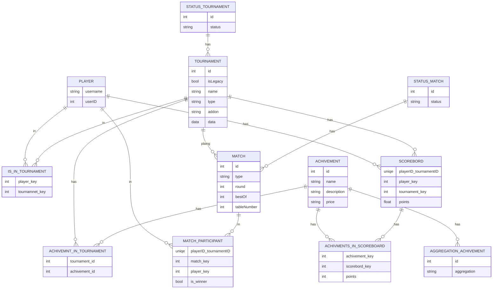

```mermaid
erDiagram
    PLAYER ||--o{ IS_IN_TOURNAMENT : in
    PLAYER ||--o{ MATCH_PARTICIPANT: in
    PLAYER ||--o{ SCOREBORD : has
    PLAYER {
        string username
        int userID
    }
    TOURNAMENT ||--o{ IS_IN_TOURNAMENT : in
    TOURNAMENT ||--o{ ACHIVEMNT_IN_TOURNAMENT : has
    TOURNAMENT ||--o{ MATCH : plaing
    TOURNAMENT ||--o{ SCOREBORD : has
    TOURNAMENT {
        int id
        bool isLegacy
        string name
        string type
        string addon
        data data
    }
    STATUS_TOURNAMENT ||--o{ TOURNAMENT : has
    STATUS_TOURNAMENT {
        int id
        string status
    }
    IS_IN_TOURNAMENT
    IS_IN_TOURNAMENT {
        int player_key
        int tournamnet_key
    }
    MATCH ||--o{ MATCH_PARTICIPANT : in
    MATCH {
        int id
        string type
        int round
        int bestOf
        int tableNumber
    }
    MATCH_PARTICIPANT {
        uniqe playerID_tournamentID
        int match_key
        int player_key
        bool is_winner
    }
    STATUS_MATCH ||--o{ MATCH : has
    STATUS_MATCH {
        int id
        string status
    }
    ACHIVEMENT ||--o{ACHIVEMNT_IN_TOURNAMENT : has
    ACHIVEMENT ||--o{AGGREGATION_ACHIVEMENT : has
    ACHIVEMENT ||--o{ACHIVMENTS_IN_SCOREBOARD : has
    ACHIVEMENT {
        int id
        string name
        string description
        string price
    }
    AGGREGATION_ACHIVEMENT {
        int id
        string aggregation
    }
    ACHIVEMNT_IN_TOURNAMENT {
        int tournament_id
        int achivement_id
    }
    SCOREBORD ||--o{ ACHIVMENTS_IN_SCOREBOARD : has
    SCOREBORD {
        uniqe playerID_tournamentID
        int player_key
        int tournament_key
        float points
    }
    ACHIVMENTS_IN_SCOREBOARD {
        int achivement_key
        int scorebord_key
        int points
    }
```
